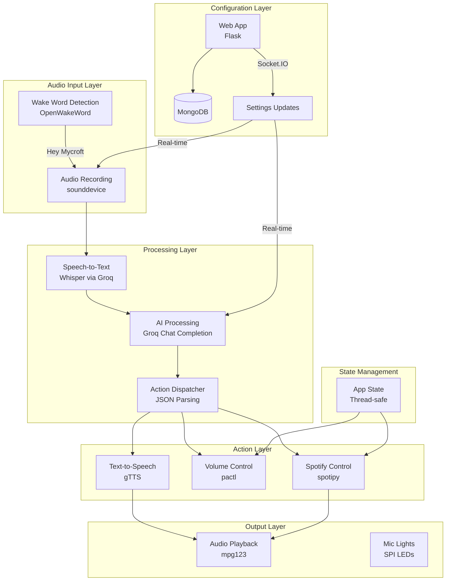
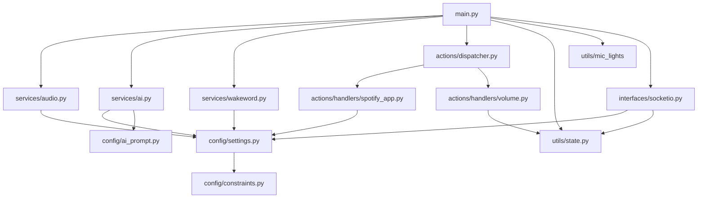
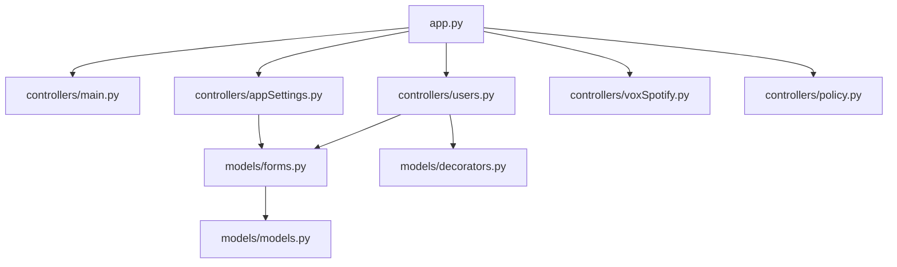

# voxMate Architecture Reference

## 1. System Overview

voxMate is a Python-powered smart speaker system that combines voice recognition, AI processing, and audio playback to create a DIY voice assistant. The system consists of two main components:

- **voxMate App** (`voxMate_app/`): Core voice assistant application that handles wake word detection, speech processing, and AI interactions
- **voxMate Web App** (`voxMate_web_app/`): Flask-based web interface for configuration, user management, and Spotify integration

The system listens for a wake word, records user speech, transcribes it using Whisper (via Groq API), processes it with AI models, and responds with text-to-speech playback. It supports Spotify integration, volume control, and real-time configuration updates.

## 2. Architecture Flow



## 3. File/Module Inventory

### Core Application (`voxMate_app/`)

#### Main Entry Point
- **`main.py`**: Application entry point and main execution loop
  - Responsibilities: Initialize services, handle wake word detection, coordinate audio processing
  - Key functions: `main()` - main execution loop with wake word detection and AI processing

#### Configuration (`config/`)
- **`settings.py`**: Configuration management with MongoDB integration
  - Responsibilities: Load user settings from MongoDB/local files, environment validation
  - Key exports: `CONFIG`, `SILENCE_THRESHOLD`, `STT_MODEL`, `AI_MODEL`, `DEFAULT_VOLUME`
  - Key functions: `load_config()`, `check_environment()`

- **`constraints.py`**: System constants and paths
  - Responsibilities: Audio parameters, file paths, Spotify configuration
  - Key exports: `SAMPLE_RATE`, `WAKE_WORD`, audio file paths, Spotify constants

- **`ai_prompt.py`**: AI prompt templates for Groq API
  - Responsibilities: Define system prompts and examples for structured AI responses
  - Key functions: `ai_prompt(prompt)` - returns formatted prompt array

#### Services (`services/`)
- **`audio.py`**: Audio processing operations
  - Responsibilities: Recording, playback, silence detection, noise reduction
  - Key class: `AudioProcessor` with methods `record_audio_to_file()`, `play_sound()`

- **`ai.py`**: AI service integration
  - Responsibilities: Speech-to-text, chat completion, text-to-speech
  - Key class: `AIService` with methods `transcribe_audio()`, `generate_response()`, `text_to_speech()`

- **`wakeword.py`**: Wake word detection
  - Responsibilities: OpenWakeWord integration, audio stream management
  - Key functions: `audio_wake_stream()`, `wake_word_detection()`

#### Actions (`actions/`)
- **`dispatcher.py`**: Action routing and execution
  - Responsibilities: Parse AI responses and dispatch to appropriate handlers
  - Key functions: `handle_action(parsed)` - routes to Spotify, volume, or other handlers

- **`handlers/spotify_app.py`**: Spotify integration
  - Responsibilities: Spotify playback control, device management, authentication
  - Key class: `SpotifyPlayer` (singleton) with methods for play, stop, skip, repeat, shuffle

- **`handlers/volume.py`**: System volume control
  - Responsibilities: Volume adjustment via pactl
  - Key functions: `change_volume(level)` - handles up/down/min/max/percentage

- **`handlers/news_weather.py`**: News and weather information
  - Responsibilities: Fetch and process news/weather data

#### Interfaces (`interfaces/`)
- **`socketio.py`**: Real-time communication with web app
  - Responsibilities: Handle settings updates via Socket.IO
  - Key exports: `sio` client instance, event handlers for settings updates

#### Utilities (`utils/`)
- **`state.py`**: Thread-safe application state management
  - Responsibilities: Manage app status, Spotify state, volume state
  - Key class: `AppState` with methods `get_state()`, `set_state()`, convenience methods

- **`mic_lights.py`**: LED control for ReSpeaker hardware
  - Responsibilities: Control APA102 LEDs via SPI for visual feedback
  - Key class: `MicLights` with methods for different light patterns

- **`logging.py`**: Centralized logging configuration
  - Responsibilities: Setup and configure application logging

- **`cleanup.py`**: Resource cleanup on exit
  - Responsibilities: Stop audio processes, turn off lights, cleanup resources
  - Key functions: `cleanup()`

### Web Application (`voxMate_web_app/`)

#### Main Application
- **`app.py`**: Flask application factory
  - Responsibilities: App initialization, MongoDB setup, session configuration
  - Key functions: `create_app()` - configures and returns Flask app

#### Controllers (`controllers/`)
- **`main.py`**: Main page controller
  - Responsibilities: Serve homepage with README content
  - Key routes: `/` - renders README as HTML

- **`appSettings.py`**: Settings management controller
  - Responsibilities: Handle user settings form, update MongoDB
  - Key routes: `/settings` - GET/POST for settings management

- **`users.py`**: User authentication controller
  - Responsibilities: Login, registration, verification
  - Key routes: `/login`, `/register`, `/verify`

- **`voxSpotify.py`**: Spotify integration controller
  - Responsibilities: OAuth flow, Spotify profile management
  - Key routes: Spotify authentication and profile endpoints

- **`policy.py`**: Policy pages controller
  - Responsibilities: Terms of service, privacy policy
  - Key routes: `/policy/cookie`, `/policy/t_c`

#### Models (`models/`)
- **`models.py`**: Data models and dataclasses
  - Responsibilities: Define User and AppSettings data structures
  - Key classes: `User`, `AppSettings`

- **`forms.py`**: WTForms form definitions
  - Responsibilities: Form validation and rendering
  - Key classes: `RegisterForm`, `SettingsForm`, `LoginForm`

- **`decorators.py`**: Route decorators
  - Responsibilities: Authentication and authorization decorators
  - Key decorators: `@isLoggedIn`

#### Utils (`utils/`)
- **`api.py`**: API utilities and helpers
  - Responsibilities: Common API functions and utilities

### Static Assets (`static/`)
- **`css/`**: Bootstrap and custom stylesheets
- **`js/`**: JavaScript files for frontend functionality
- **`images/`**: Static images and logos

### Templates (`templates/`)
- **`layouts/`**: Base templates and common layout elements
- **`main/`**: Homepage templates
- **`users/`**: Authentication-related templates
- **`appSettings/`**: Settings page templates
- **`voxSpotify/`**: Spotify integration templates
- **`policy/`**: Policy page templates

## 4. Dependency Map

### Core Dependencies


### Web App Dependencies


### External Dependencies
- **Audio**: `sounddevice`, `pyaudio`, `mpg123`
- **AI**: `openai` (Groq), `gtts`
- **Wake Word**: `openwakeword`
- **Web**: `Flask`, `Flask-SocketIO`, `Flask-WTF`
- **Database**: `pymongo` (MongoDB)
- **Spotify**: `spotipy`
- **Hardware**: `spidev` (LED control)

### Entry Points
- **Voice Assistant**: `voxMate_app/main.py`
- **Web Interface**: `voxMate_web_app/app.py`

### Circular Dependencies
- No significant circular dependencies detected
- Clean separation between app and web app modules

## 5. Data Flow

### Voice Command Processing Flow
1. **Wake Word Detection**: OpenWakeWord continuously monitors audio stream
2. **Audio Recording**: `AudioProcessor.record_audio_to_file()` captures user speech
3. **Speech-to-Text**: `AIService.transcribe_audio()` sends audio to Groq Whisper API
4. **AI Processing**: `AIService.generate_response()` sends transcript to Groq chat completion
5. **Action Parsing**: `handle_action()` parses JSON response and routes to handlers
6. **Execution**: Appropriate handler (Spotify, volume, etc.) executes the action
7. **Response**: `AIService.text_to_speech()` converts response to speech and plays it

### Settings Update Flow
1. **Web Form**: User submits settings via web interface
2. **Database Update**: Flask controller updates MongoDB
3. **Socket.IO Emission**: Web app emits `settings_updated` event
4. **Real-time Update**: Voice assistant receives update via Socket.IO client
5. **Config Reload**: `load_config()` reloads settings from MongoDB
6. **Service Update**: Audio and AI services use new configuration

### Spotify Integration Flow
1. **Authentication**: OAuth flow via web app stores tokens in MongoDB
2. **Device Management**: SpotifyPlayer discovers and caches device ID
3. **Command Processing**: AI generates Spotify action JSON
4. **API Calls**: SpotifyPlayer uses spotipy to control playback
5. **State Sync**: App state updated to reflect Spotify status

## 6. Key Interactions

### Voice Assistant Startup
```
main.py → settings.check_environment() → AudioProcessor → MicLights → AIService → Socket.IO connect
```

### Wake Word to Response
```
wakeword.py → audio.py → ai.py (transcribe) → ai.py (generate) → dispatcher.py → handlers → ai.py (TTS) → audio.py (play)
```

### Settings Update
```
web app → MongoDB → Socket.IO emit → socketio.py → settings.py → service updates
```

### Spotify Control
```
AI response → dispatcher.py → spotify_app.py → spotipy → Spotify API → state.py update
```

### Volume Control
```
AI response → dispatcher.py → volume.py → pactl subprocess → state.py update
```

## 7. Extension Points

### Adding New Voice Commands
1. **Update AI Prompt**: Modify `config/ai_prompt.py` to include new action types
2. **Create Handler**: Add new handler in `actions/handlers/`
3. **Update Dispatcher**: Add routing logic in `actions/dispatcher.py`
4. **Add Settings**: If configurable, add to web app forms and database schema

### Adding New Audio Features
1. **Extend AudioProcessor**: Add methods to `services/audio.py`
2. **Update Configuration**: Add new settings to `config/settings.py`
3. **Web Interface**: Add controls to `voxMate_web_app/controllers/appSettings.py`
4. **Forms**: Update `models/forms.py` with new form fields

### Adding New Integrations
1. **Service Layer**: Create new service in `services/`
2. **Handler**: Create handler in `actions/handlers/`
3. **Configuration**: Add API keys and settings to environment and config
4. **Web Interface**: Add configuration UI if needed

### Hardware Extensions
1. **Hardware Utils**: Add new utility in `utils/`
2. **Integration**: Connect to main application in `main.py`
3. **State Management**: Add state tracking in `utils/state.py`
4. **Cleanup**: Ensure proper cleanup in `utils/cleanup.py`

### Web App Extensions
1. **New Controller**: Add controller in `controllers/`
2. **Models**: Define data models in `models/`
3. **Templates**: Create templates in `templates/`
4. **Routes**: Register blueprint in `app.py`

### Database Schema Extensions
1. **Models**: Update dataclasses in `models/models.py`
2. **Forms**: Update form definitions in `models/forms.py`
3. **Controllers**: Update controllers to handle new fields
4. **Settings**: Update configuration loading in `config/settings.py`

This architecture provides a solid foundation for extending voxMate with new features while maintaining clean separation of concerns and modular design.