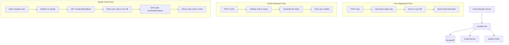
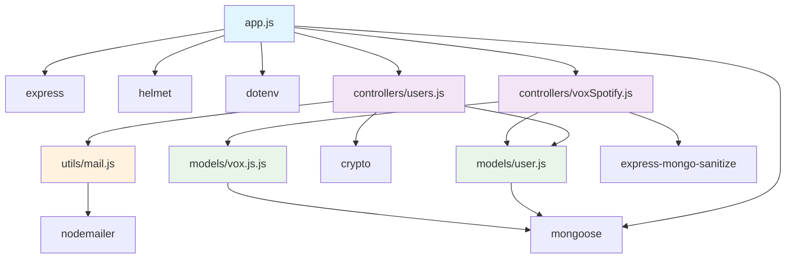

# voxMate API Architecture Reference

## 1. System Overview

voxMate API is a Node.js/Express backend service that provides secure authentication and Spotify OAuth integration for the voxMate smart speaker application. The API operates as a headless service that:

- Manages user registration and email verification
- Handles Spotify OAuth2 authentication flow
- Issues secure API tokens for authenticated clients
- Provides callback handling for Spotify authorization
- Serves as the bridge between smart speaker devices and Spotify services

**Core Components:**

- Express.js web server with security middleware
- MongoDB database with Mongoose ODM
- Email service for user verification
- Spotify OAuth integration layer

## 2. Architecture Flow



## 3. File/Module Inventory

### Core Application Files

#### `app.js` - Main Application Entry Point

**Purpose**: Express server setup, middleware configuration, and route definition
**Key Responsibilities**:

- Database connection management
- Security middleware configuration (Helmet, mongoSanitize)
- Route registration for users and Spotify integration
- Environment-specific configuration
  **Main Functions**: Server initialization on port 3003

### Controllers Layer

#### `controllers/users.js` - User Authentication Controller

**Purpose**: Handles user registration and email verification
**Key Responsibilities**:

- Generate and manage 6-digit verification codes
- Email verification workflow
- API token generation and management
- User creation and updates
  **Main Exports**:
- `new(req, res)` - Create new user or update existing with verification code
- `verify(req, res)` - Verify email code and issue API token

#### `controllers/voxSpotify.js` - Spotify Integration Controller

**Purpose**: Manages Spotify OAuth2 callback and token retrieval
**Key Responsibilities**:

- Handle Spotify OAuth callbacks
- Store Spotify authorization codes
- Provide polling endpoint for auth status
  **Main Exports**:
- `callback(req, res)` - Process Spotify OAuth callback
- `waiting(req, res)` - Polling endpoint for auth code retrieval

### Data Models

#### `models/user.js` - User Data Model

**Purpose**: Mongoose schema for user authentication data
**Key Responsibilities**:

- User identity and verification state management
- API token storage
- Device association
  **Schema Fields**:
- `user_id` (String, required) - Unique user identifier
- `user_email` (String, required) - User email address
- `device_id` (String, required) - Associated device identifier
- `verify` (Boolean, required) - Email verification status
- `code` (String, optional) - 6-digit verification code
- `codeCreatedAt` (Date, optional) - Code generation timestamp
- `api_token` (String, optional) - Authentication token

#### `models/vox.js.js` - Spotify Integration Data Model

**Purpose**: Mongoose schema for Spotify OAuth data
**Key Responsibilities**:

- Store Spotify authorization codes
- Track OAuth errors
  **Schema Fields**:
- `user_id` (String, required) - Reference to user
- `error` (String, optional) - OAuth error message
- `code` (String, optional) - Spotify authorization code

### Utilities

#### `utils/mail.js` - Email Service Utility

**Purpose**: Email sending functionality using Nodemailer
**Key Responsibilities**:

- Send verification emails via Zoho SMTP
- Handle email configuration and transport
  **Main Exports**:
- `mail(subject, text, to)` - Send email function

### Static Assets

#### `public/favicon/` - Favicon Files

**Purpose**: Browser favicon assets for the service
**Files**: Various sized favicon files for different platforms

## 4. Dependency Map



### Core Dependencies

- **Express.js**: Web framework and routing
- **Mongoose**: MongoDB ODM for database operations
- **Helmet**: Security headers middleware
- **Nodemailer**: Email sending service
- **express-mongo-sanitize**: MongoDB injection protection

### Entry Points

- **Primary**: `app.js` - Server initialization and middleware setup
- **API Routes**: `/new`, `/verify`, `/voxSpotify/callback`, `/voxSpotify/waiting`

### Circular Dependencies

- **None detected** - Clean hierarchical dependency structure

## 5. Data Flow

### User Registration Flow

1. **Client Request** → `POST /new` with `device_id`, `unverified_user_id`, `email`
2. **Controller** → Generate 6-digit code using `crypto.randomInt()`
3. **Database** → Create/update User document with verification code
4. **Email Service** → Send verification code via `utils/mail.js`
5. **Response** → Return success status to client

### Email Verification Flow

1. **Client Request** → `POST /verify` with verification details
2. **Controller** → Validate code and check 1-hour expiry
3. **Database** → Update User document with `api_token` and `verify: true`
4. **Response** → Return `api_token` for authenticated requests

### Spotify OAuth Flow

1. **Client** → Initiates Spotify auth with `api_token` as state parameter
2. **Spotify** → Redirects to `/voxSpotify/callback` with auth code
3. **Controller** → Validates `api_token` and stores auth code in Vox collection
4. **Client Polling** → `POST /voxSpotify/waiting` to retrieve auth code
5. **Response** → Return Spotify auth code to client for token exchange

## 6. Key Interactions

### Critical File Interactions

#### Authentication Workflow

```
controllers/users.js ←→ models/user.js ←→ MongoDB
                    ↓
                utils/mail.js ←→ Zoho SMTP
```

#### Spotify Integration Workflow

```
controllers/voxSpotify.js ←→ models/vox.js.js ←→ MongoDB
                         ↘ models/user.js (for token validation)
```

#### Security Middleware Chain

```
app.js → helmet() → mongoSanitize() → express.json() → Route Handlers
```

### Most Important Interactions

1. **User Creation**: `controllers/users.js:new()` → `models/user.js` → `utils/mail.js`
2. **Token Validation**: `controllers/voxSpotify.js:*` → `models/user.js` (api_token lookup)
3. **Code Storage**: `controllers/voxSpotify.js:callback()` → `models/vox.js.js`

## 7. Extension Points

### Adding New Authentication Methods

**Files to Modify**:

- `controllers/users.js` - Add new auth endpoints
- `models/user.js` - Extend schema for new auth fields
- `app.js` - Register new routes

### Adding New Music Service Integrations

**Files to Modify**:

- Create new controller in `controllers/` directory
- Create new model in `models/` directory
- `app.js` - Register new service routes
- Consider abstracting common OAuth logic

### Enhancing Security Features

**Files to Modify**:

- `app.js` - Add new security middleware
- `controllers/users.js` - Implement rate limiting, additional validation
- `models/user.js` - Add security-related fields (e.g., failed login attempts)

### Database Schema Extensions

**Files to Modify**:

- `models/user.js` - Add new user-related fields
- `models/vox.js.js` - Add new service integration fields
- Consider migration strategy for existing data

### API Versioning

**Files to Modify**:

- `app.js` - Add version-specific route prefixes
- Controllers - Create versioned controller files
- Consider implementing API versioning middleware

### Monitoring and Logging

**Files to Modify**:

- `app.js` - Add request logging middleware
- Controllers - Add operation-specific logging
- Consider implementing structured logging with Winston or similar

### Testing Infrastructure

**Files to Add**:

- `tests/` directory with unit and integration tests
- `package.json` - Add testing framework (Jest, Mocha, etc.)
- Test configuration files
- Mock services for email and Spotify API testing
